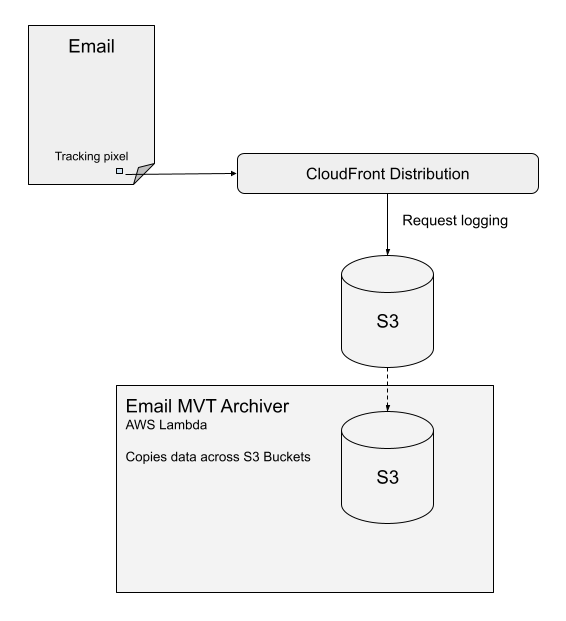

# Tracking multi-variant content components within emails

This repo contains software which enables GNM to track which content variants Guardian account holders see within instrumented newsletter emails.

- `email-mvt-pixel` folder used to contain legacy AWS CDK code which generated the CloudFormation to build the pixel. It was rebuilt in March 2023 within the `cdk`project.
- `email-mvt-archive` contains code for a Lambda function which executes daily and copies the logs into another S3 bucket in folders representing daily batches. This enables a partitioned Athena table to be placed over-the-top. In production the data is copied over to GCP and processed by DBT jobs in BigQuery.
- `cdk` contains [gu-cdk](https://github.com/guardian/cdk) code which generates the CloudFormation `.json` files for the archiver Lambda above.
- `email-mvt-athena` folder contains code to generate an Athena table, and scripts to generate a materialised view of the pixel data in a tabular format. Both of these are for developer testing / validation, and are not consumed by any business unit.

### Architecture Diagram

